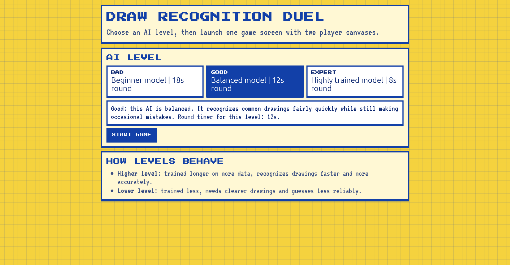
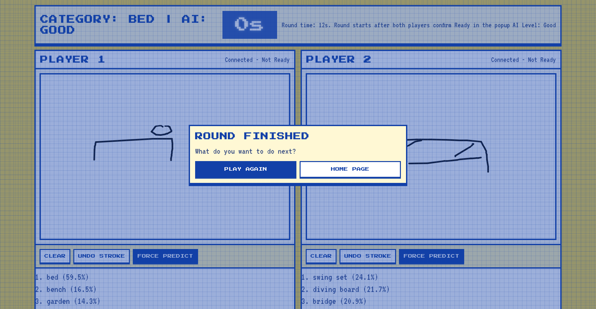

# PictionAIry

PictionAIry is a playful AI workshop built for **Les Ateliers du Techlab** at **L'Ecole des Mines de Nancy**.

The goal is to explain, to middle-school and high-school visitors, how **supervised learning** works:
- a model learns from many examples with labels,
- training happens over multiple **epochs**,
- and more training usually improves recognition quality.

In this workshop, visitors can directly feel this effect by choosing AI levels linked to different training stages.





## Workshop Game Concept

Two players draw at the same time.

1. The AI gives a word to draw (same word for both players).
2. Each player tries to draw it so the AI recognizes it first.
3. The first player whose drawing is guessed correctly wins the round.

This creates a fast, competitive way to discover:
- what makes a drawing easy/hard for AI,
- why model quality matters,
- and how training choices affect behavior.

## Project Structure

There are 3 main folders:

- `front/`: the UI (menu + game screen) and Socket.IO client logic. It sends drawing points and receives predictions.
- `python/`: Flask + Socket.IO backend, game state, preprocessing, model inference, and training scripts.
- `models/`: model artifacts (`.pt` / TorchScript) used for the AI levels.

Note: in this codebase, runtime loading currently points to `python/ml/models/` for model files.

## Supervised Learning in This Project

The training data comes from Quick, Draw! style datasets (`.ndjson` files) where each sketch has:
- a category label (for example `cat`, `bus`, `apple`),
- pen trajectories (stroke coordinates),
- and a `recognized` flag.

The task is a **multi-class classification** problem: predict the right category among hundreds of classes.

### Why Epochs Matter

An epoch is one full pass over the training set.

- Fewer epochs -> undertrained model -> weaker guesses.
- More epochs -> usually better representation -> stronger guesses (until overfitting).

In PictionAIry, the selected AI level (`Bad`, `Good`, `Expert`) is intended to map to models saved after different training durations.

At inference time, the backend selects model files by level name (for example `GRUModelBad.pt`, `GRUModelGood.pt`, `GRUModelExpert.pt`, same for CNN).

## Two Neural Networks for One Drawing Task

The system combines two model families:

1. **GRU model** (sequence-based)
2. **CNN model** (image-based)

They look at the same drawing from two perspectives.

### 1) GRU Model (sequence of pen motion)

The GRU receives a sequence of `(x, y, pen)`-style information derived from strokes.

Simple example of a stroke sequence:

```text
[(10, 20, 0), (12, 23, 0), (15, 28, 1)]
```

- `x`, `y`: pen position
- `pen = 0`: stroke continues
- `pen = 1`: stroke ends (pen up)

In preprocessing, the pipeline:
- aligns and rescales points to a normalized drawing space,
- converts absolute positions to motion deltas (`dx`, `dy`),
- normalizes deltas with dataset statistics,
- truncates/pads sequences to a fixed length (100 steps),
- feeds tensor shape `(N, 100, 3)` to the GRU.

This helps the model learn **how** the drawing is made over time.

### 2) CNN Model (raster image)

The CNN sees the drawing as an image:
- blank pixels are `0`,
- drawn pixels are `1`.

Pipeline summary:
- strokes are rasterized on a `255 x 255` grid,
- line segments are interpolated between sampled points,
- output tensor has shape `(N, 3, 255, 255)` (3 channels with the same drawing mask).

This helps the model learn the global visual shape.

### Fusion of GRU + CNN Predictions

At runtime, predictions from both models are combined.
The blend gives increasing weight to CNN as the drawing accumulates more points, so early guesses rely more on sequence dynamics and later guesses rely more on completed shape.

## Training Pipeline (Python)

Main training entry point:
- `python/ml/train/train.py`

It supports both model types via `--model-type CNN` or `--model-type GRU` and uses QuickDraw datasets from:
- `python/ml/train/quickdraw_simplified/`

Useful command examples (from `python/`):

```bash
python -m ml.train.train --model-name GRUModel --model-type GRU --device cpu
python -m ml.train.train --model-name CNNModel --model-type CNN --device cpu
```

Training utilities:
- build train/validation/test loaders,
- log metrics,
- save checkpoints.

To create workshop levels based on epochs, keep checkpoints from different training stages, then publish them with level names expected by the server (`Bad`, `Good`, `Expert`).

## Run the Workshop App

In a python environment:

```bash
cd draw_recogintion_techlab
pip install -r requirements.txt
```


From the project root:

```bash
cd python
python main.py
```

Then open:
- `http://localhost:5000/` for the menu,
- start a game from there.

## Educational Objectives for Visitors

By the end of the activity, students should understand:
- what supervised learning means (examples + labels),
- what an epoch is,
- why model quality depends on training duration,
- why the same drawing can be easy for one model level and hard for another.

PictionAIry turns these abstract ML ideas into a visible, competitive experience.
